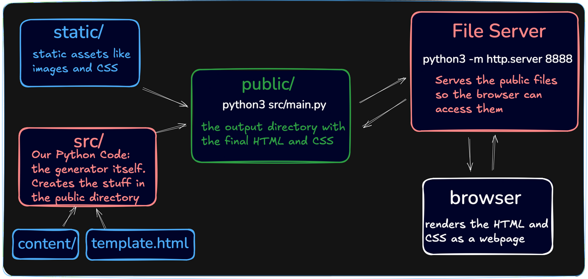

# static-site-generator

A static site generator built in Python.
It converts markdown files to HTML files that can be viewed with Pythons built-in HTTP-server.

From the [Boot.dev](https://www.google.com) course [Build a static site generator](https://www.boot.dev/lessons/7d4f1f5a-215d-4dc2-ad7a-2728c23fb695)